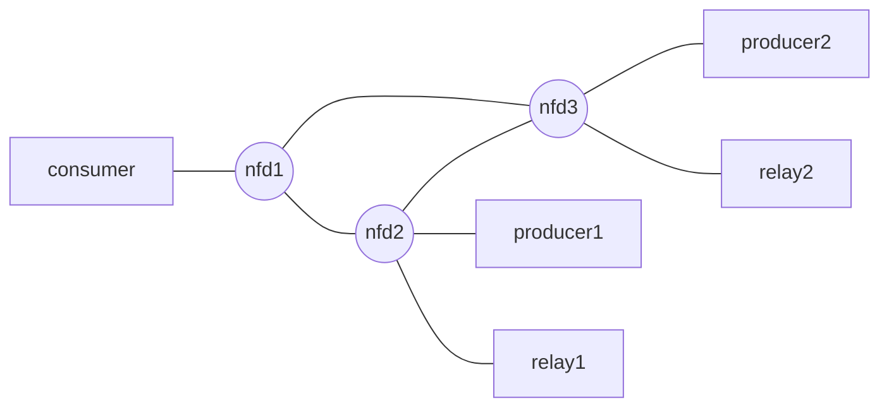

# Minimal Docker NDN SFC Experiment

This repository is a small Docker Compose experiment for NDN Service Function
Chaining. It keeps the relay idea from
[hydrokhoos/relayPod-ICSM](https://github.com/hydrokhoos/relayPod-ICSM/tree/main),
but removes the Kubernetes, sidecar/service split, IPFS pieces, and larger
framework code so the next experiment is easy to inspect and modify.

## What It Does

The consumer requests:

```text
/relay/sample.txt
```

The relay receives the Interest under `/relay`, converts the name to:

```text
/sample.txt
```

Then it fetches `/sample.txt` from the producer, applies `process_content()`,
and returns the processed Data to the consumer. The current processing function
is pass-through, so the expected output is:

```text
Hello from NDN producer.
```

## Directory Structure

```text
.
├── README.md
├── docker-compose.yaml
├── docker-compose.topology.yaml
├── nfd/
│   ├── start.sh
│   └── nfd.conf
├── relay/
│   ├── relay.py
│   ├── start.sh
│   └── requirements.txt
├── producer/
│   └── start.sh
└── consumer/
    └── fetch.sh
```

## Docker Topology

All NDN-related services use:

```text
hydrokhoos/ndn-all:latest
```

The Compose file starts one shared NFD container. Producer, relay, and consumer
connect to that shared forwarder with:

```text
NDN_CLIENT_TRANSPORT=tcp4://nfd:6363
```

The shared NFD uses `nfd/nfd.conf`, mounted at
`/usr/local/etc/ndn/nfd.conf` and started with `nfd-start`. This configuration
is based on the upstream NFD sample configuration and changes the demo hub
behavior explicitly:

- TCP listens on port `6363`
- TCP faces from local and Docker bridge networks are treated as local-scope
  faces
- management authorizations and validation use demo-only `any` trust settings
- `rib.localhop_security` is enabled so Docker containers can register prefixes
  through the shared NFD hub
- `auto_prefix_propagate` is omitted because NFD 24.07 does not allow it to be
  enabled together with `localhop_security`
- UDP multicast is enabled in the minimal NFD style, although this experiment
  primarily uses the single TCP hub

Services:

- `nfd`: shared NDN forwarder
- `producer`: publishes `/sample.txt` with `ndnputchunks`
- `relay`: Python `NDNApp` registering `/relay`
- `consumer`: fetches `/relay/sample.txt` with `ndncatchunks -D`

The producer, relay, and consumer do not start their main NDN work immediately.
They first wait until `nfdc status` succeeds against the shared NFD. The
consumer also waits until routes for `/sample.txt` and `/relay` are visible in
the shared FIB before running `ndncatchunks`. It uses `-D` to skip version
discovery metadata and keep this first relay experiment focused on the explicit
`/relay/...` to `/...` forwarding rule.

## Run

From this repository:

```sh
docker compose up --build
```

The consumer should print:

```text
Hello from NDN producer.
```

## Multi-NFD Topology Check

For a slightly larger static topology, run:

```sh
docker compose -f docker-compose.topology.yaml up --build
```

This Compose file models the following graph with separate Docker networks:



```text
[consumer, nfd1]
[nfd1, nfd2]
[nfd1, nfd3]
[nfd2, nfd3]
[nfd2, producer1]
[nfd3, producer2]
[nfd2, relay1]
[nfd3, relay2]
```

It does not run NLSR. Instead, each NFD starts with `nfd/start.sh`, creates UDP
faces to its NFD neighbors, and installs a small set of static routes:

- `consumer` connects only to `nfd1`
- `producer1` publishes `/sample.txt` on `nfd2`
- `producer2` publishes `/sample.txt` on `nfd3`
- `relay1` registers `/relay1` on `nfd2` and maps `/relay1/sample.txt` to `/sample.txt`
- `relay2` registers `/relay2` on `nfd3` and maps `/relay2/sample.txt` to `/sample.txt`
- `consumer` fetches `/relay1/sample.txt` and `/relay2/sample.txt`

Expected output includes:

```text
Hello from producer1.
Hello from producer2.
```

## Name Conversion Rule

The conversion is intentionally simple and explicit:

```text
/relay/sample.txt -> /sample.txt
/relay/a/b/c     -> /a/b/c
```

In the multi-NFD topology, each relay still only removes its own SFC name:

```text
/relay1/sample.txt -> /sample.txt
/relay2/sample.txt -> /sample.txt
```

The helper is `strip_relay_prefix()` in `relay/relay.py`.

## Modify The Processing Function

Edit `process_content()` in `relay/relay.py`:

```python
def process_content(data: bytes) -> bytes:
    return data
```

For example, a later experiment could transform, compress, filter, or annotate
the returned bytes there.

## Lightweight Local Checks

These checks do not require building NFD, ndn-tools, or python-ndn from source:

```sh
python3 -m py_compile relay/relay.py
RELAY_SELF_TEST=1 python3 relay/relay.py
```

The self-test covers the explicit name conversion rule and basic segmentation
helper.

## Current Limitations

- This is a minimal experiment, not a production relay.
- Relay-side object caching is in memory only.
- The relay waits to process the complete producer object before serving chunks.
- The relay serves versionless chunks and does not implement RDR metadata
  rewriting.
- Producer Data uses digest signing and does not create a producer identity.
  The relay still creates a minimal local identity for prefix registration with
  NFD; returned relay Data is digest signed.
- The Docker flow assumes `hydrokhoos/ndn-all:latest` provides NFD,
  `ndnputchunks`, `ndncatchunks`, and Python support for `python-ndn`.
- Startup ordering uses small shell readiness loops around `nfdc status` and
  `nfdc fib`, not a full health-check framework.
