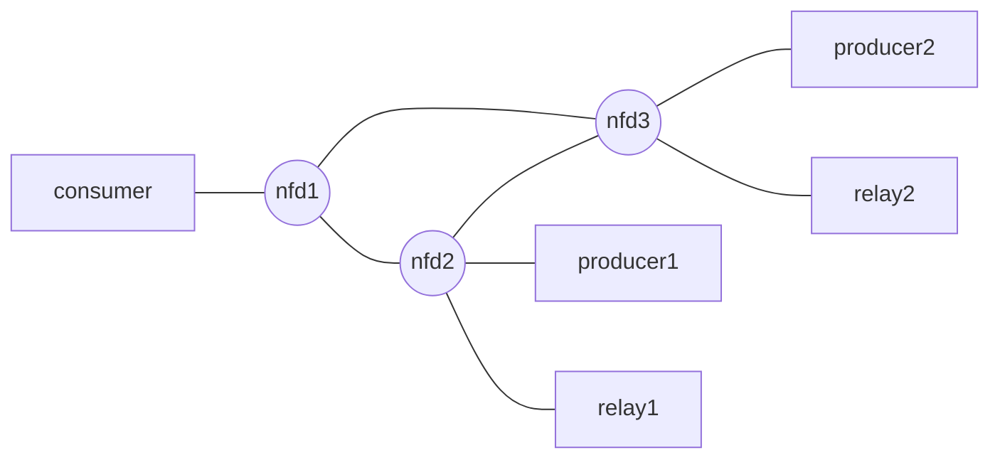
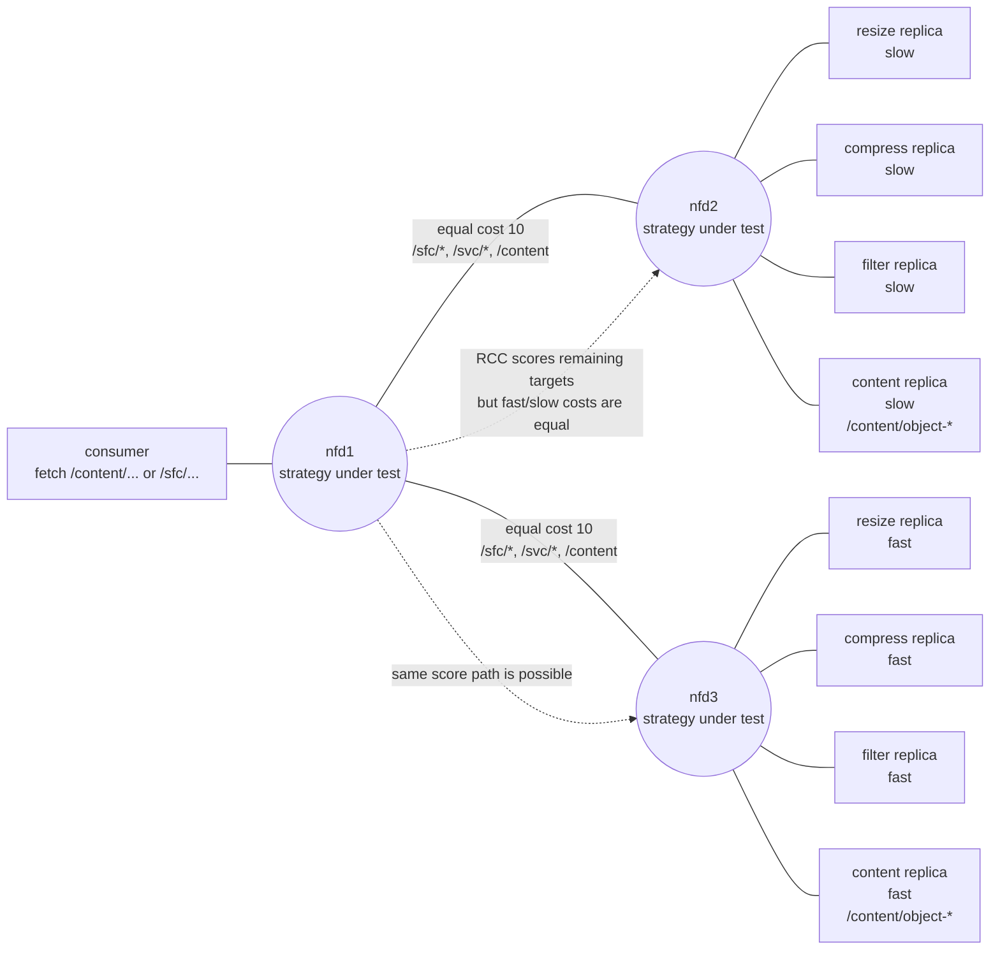

# Docker による最小 NDN SFC 実験

このリポジトリは、NDN Service Function Chaining(SFC) を Docker Compose で小さく試すための実験環境です。
[hydrokhoos/relayPod-ICSM](https://github.com/hydrokhoos/relayPod-ICSM/tree/main) の relay の考え方を残しつつ、Kubernetes、sidecar/service 分離、IPFS、大きな framework 部分を外し、次の実験を読みやすく変更しやすい形にしています。

## 基本デモ

consumer は次の Interest を送ります。

```text
/relay/sample.txt
```

relay は `/relay` 配下の Interest を受け取り、名前を次のように変換します。

```text
/sample.txt
```

その後、producer から `/sample.txt` を取得し、`process_content()` を適用してから consumer に Data を返します。現在の処理関数は pass-through なので、期待される出力は次の通りです。

```text
Hello from NDN producer.
```

## ディレクトリ構成

```text
.
├── README.md
├── docker-compose.yaml
├── docker-compose.topology.yaml
├── docker-compose.comparison.yaml
├── run-sfc-comparison.sh
├── comparison/
│   ├── consumer.py
│   ├── content_producer.py
│   └── sfc_service.py
├── nfd-strategy/
│   ├── Dockerfile
│   └── strategies/
├── nfd/
│   ├── start.sh
│   └── nfd.conf
├── relay/
│   ├── relay.py
│   ├── start.sh
│   └── requirements.txt
├── producer/
│   └── start.sh
└── consumer/
    └── fetch.sh
```

## Docker トポロジ

NDN 関連のコンテナは基本的に次の image を使います。

```text
hydrokhoos/ndn-all:latest
```

通常の `docker-compose.yaml` は、1 つの共有 NFD コンテナを起動します。producer、relay、consumer は次の transport でその forwarder に接続します。

```text
NDN_CLIENT_TRANSPORT=tcp4://nfd:6363
```

共有 NFD は `nfd/nfd.conf` を `/usr/local/etc/ndn/nfd.conf` に mount し、`nfd-start` で起動します。この設定は upstream NFD の sample 設定を元にしつつ、デモ用に次の点を明示しています。

- TCP は port `6363` で listen します。
- local と Docker bridge network からの TCP face を local-scope face として扱います。
- management authorization と validation はデモ用の `any` trust 設定を使います。
- Docker コンテナから共有 NFD hub へ prefix 登録できるように `rib.localhop_security` を有効化します。
- NFD 24.07 では `localhop_security` と同時に使えないため、`auto_prefix_propagate` は省いています。
- UDP multicast も最小 NFD 設定に合わせて有効化しています。ただし、この基本デモでは主に単一 TCP hub を使います。

サービス構成:

- `nfd`: 共有 NDN forwarder
- `producer`: `ndnputchunks` で `/sample.txt` を publish
- `relay`: Python `NDNApp` で `/relay` を登録
- `consumer`: `ndncatchunks -D` で `/relay/sample.txt` を fetch

producer、relay、consumer は、起動直後に本処理を始めません。まず `nfdc status` が成功するまで待ちます。consumer はさらに、共有 FIB に `/sample.txt` と `/relay` の route が見えるまで待ってから `ndncatchunks` を実行します。`-D` は version discovery metadata を省略し、`/relay/...` から `/...` への明示的な relay 動作に絞るために使っています。

## 実行方法

基本デモは、このディレクトリから次のように実行します。

```sh
docker compose up --build
```

consumer に次の出力が表示されれば成功です。

```text
Hello from NDN producer.
```

## 複数 NFD トポロジ確認

少し大きい静的トポロジを確認する場合は、次を実行します。

```sh
docker compose -f docker-compose.topology.yaml up --build
```

この Compose file は、別々の Docker network で次のグラフを表します。



network の対応は次の通りです。

```text
[consumer, nfd1]
[nfd1, nfd2]
[nfd1, nfd3]
[nfd2, nfd3]
[nfd2, producer1]
[nfd3, producer2]
[nfd2, relay1]
[nfd3, relay2]
```

この構成では NLSR は使いません。各 NFD は `nfd/start.sh` で起動し、隣接 NFD への UDP face を作り、少数の静的 route を投入します。

- `consumer` は `nfd1` のみに接続します。
- `producer1` は `nfd2` 上で `/sample.txt` を publish します。
- `producer2` は `nfd3` 上で `/sample.txt` を publish します。
- `relay1` は `nfd2` 上で `/relay1` を登録し、`/relay1/sample.txt` を `/sample.txt` に変換します。
- `relay2` は `nfd3` 上で `/relay2` を登録し、`/relay2/sample.txt` を `/sample.txt` に変換します。
- `consumer` は `/relay1/sample.txt` と `/relay2/sample.txt` を fetch します。

期待される出力には次が含まれます。

```text
Hello from producer1.
Hello from producer2.
```

## 名前変換ルール

基本 relay の変換は意図的に単純で明示的です。

```text
/relay/sample.txt -> /sample.txt
/relay/a/b/c     -> /a/b/c
```

複数 NFD トポロジでも、それぞれの relay は自分自身の SFC 名だけを外します。

```text
/relay1/sample.txt -> /sample.txt
/relay2/sample.txt -> /sample.txt
```

この helper は `relay/relay.py` の `strip_relay_prefix()` です。

## 処理関数の変更

relay の処理を変える場合は、`relay/relay.py` の `process_content()` を編集します。

```python
def process_content(data: bytes) -> bytes:
    return data
```

例えば、後続の実験では transform、compress、filter、annotate などの処理をここに入れられます。

## 軽量ローカル確認

NFD、ndn-tools、python-ndn を source build せずに、relay の基本チェックだけを実行できます。

```sh
python3 -m py_compile relay/relay.py
RELAY_SELF_TEST=1 python3 relay/relay.py
```

self-test は明示的な名前変換ルールと基本的な segmentation helper を確認します。

## SFC Strategy 比較デモ

比較デモでは、同じ小さな SFC workload を次の 3 つの forwarding strategy で実行します。

- `best-route`
- `least-pending-interests`
- `remaining-chain-cost`

測定する指標は、今回の最小デモでは次の 2 つです。

- convergence time
- response time

対象 scenario は次の 3 つです。

- `content-only`: consumer が `/content/object-<seq>` を直接 fetch します。
- `single-chain`: consumer が `/sfc/resize/object-<seq>` を fetch します。
- `deep-chain`: consumer が `/sfc/resize/compress/filter/object-<seq>` を fetch します。

SFC 要求名は、現在の RCC 実装に合わせて次の形式を使います。

```text
/sfc/<service1>/<service2>/.../<content-id>
```

例えば deep-chain では次の Interest 名になります。

```text
/sfc/resize/compress/filter/object-1
```

この名前は RCC strategy で次の remaining targets として解釈されます。

```text
/svc/resize
/svc/compress
/svc/filter
/content/object-1
```

### 比較用トポロジ

比較デモでは、custom NFD image に LPI と RCC strategy を組み込み、`nfd1`、`nfd2`、`nfd3` の全 NFD で同じ strategy を選択できるようにしています。`nfd1` が consumer 側の比較観測点です。`resize`、`compress`、`filter`、`content` は、それぞれ `nfd2` 側に slow replica、`nfd3` 側に fast replica を置いています。



今回の比較環境では、fast replica と slow replica の FIB cost は同じにしています。つまり `nfd2` 側の slow replica と `nfd3` 側の fast replica は、strategy からは route cost 上は等価に見えます。fast/slow の差は app 側の処理遅延だけです。

- `best-route` は同一 cost の候補から、既存実装の順序や eligible 判定に従って選びます。
- `remaining-chain-cost` は `/svc/...` と `/content/...` の残余チェイン cost を計算しますが、今回の cost 設定では fast/slow を cost から区別できません。同点時は next service cost、FaceId などの tie-break に従います。
- `least-pending-interests` は FIB prefix/Face ごとの pending Interest 数を使うため、concurrency が高い場合に選択が変わる可能性があります。

全 NFD に RCC を設定した場合でも、RCC はローカル service replica がある NFD では `/sfc/<service>/...` を local face へ handoff します。これにより、`nfd1` では remaining chain cost で次 hop を選び、`nfd3` では同じ RCC strategy が `resize` service app へ渡す、という動作になります。

### 比較の実行

全組み合わせを実行します。

```sh
./run-sfc-comparison.sh
```

よく使う調整値は環境変数で指定できます。

```sh
REQUEST_COUNT=5 RUNS=1 ./run-sfc-comparison.sh
STRATEGIES="best-route remaining-chain-cost" SCENARIOS="single-chain deep-chain" ./run-sfc-comparison.sh
```

結果は `comparison-results/<timestamp>/` に保存されます。主な出力は `summary.csv` です。各 run directory には compose log と `nfd1`、`nfd2`、`nfd3` の NFD log も保存されます。

RCC の選択結果は次のように確認できます。

```sh
grep "remaining-chain-cost selected face" comparison-results/*/*/nfd1.log
grep "remaining-chain-cost local-service" comparison-results/*/*/nfd3.log
```

この比較デモは静的 route と application-level SFC relay chain を使います。`discovery completeness` と `load balancing fairness` は今回の最小デモでは計算しません。

## 現在の制限

- これは最小実験環境であり、production relay ではありません。
- relay 側の object cache は memory 上のみです。
- relay は producer object 全体を取得してから chunk を返します。
- relay は versionless chunks を返し、RDR metadata rewriting は実装していません。
- producer Data は digest signing を使い、producer identity は作りません。relay は NFD への prefix registration 用に最小 local identity を作ります。relay が返す Data も digest signed です。
- Docker flow は `hydrokhoos/ndn-all:latest` が NFD、`ndnputchunks`、`ndncatchunks`、Python support for `python-ndn` を含むことを前提にしています。
- 起動順序は `nfdc status` と `nfdc fib` に対する短い readiness loop で扱っており、完全な health-check framework ではありません。
- RCC は厳密なチェイン全体最短経路探索ではなく、Face 単位の残余チェイン到達 cost による近似です。
- content prefix は現在の実装では単一 component のみを想定しています。
